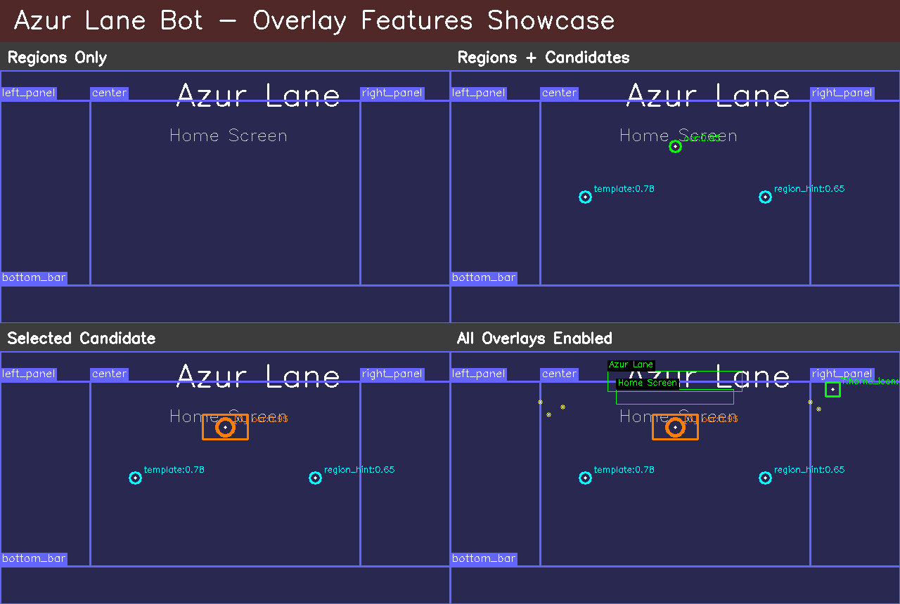

# Azur Lane Bot — Intelligent Game Automation Framework

[](https://github.com/coldaine/AzurOrchestrator/actions)
[](https://www.python.org/downloads/)
[](LICENSE)

An intelligent, multi-modal automation framework for the mobile game Azur Lane, designed for Linux with Android emulation. Built with a vision-first approach combining LLM reasoning, OCR, and computer vision for robust, resolution-agnostic automation.

## 🌟 Key Features

### Intelligence & Vision
- **🧠 Multi-Modal Vision Pipeline**: Seamlessly combines LLM reasoning (Gemini), dual OCR engines (PaddleOCR/Tesseract), template matching, and ORB feature detection
- **🎯 Intelligent Arbitration**: LLM acts as final arbiter when vision methods disagree, ensuring reliable detection
- **📐 Resolution-Agnostic Design**: Normalized coordinate system (0.0-1.0) works across any screen resolution without reconfiguration
- **🔍 Selector-Based Architecture**: Abstract selectors (text/icon/region) instead of hardcoded pixels for maintainability

### Performance & Efficiency
- **⚡ Smart Frame Processing**: Perceptual hashing skips redundant processing on identical frames (~80% compute savings)
- **🎬 Adaptive Frame Rate**: Dynamic FPS adjustment (0.2-2.0 FPS) based on activity—idle during loading, active during interaction
- **💾 Memory Efficient**: <500MB baseline, <1GB peak with full vision pipeline
- **⏱️ Fast Actions**: <2 second tap latency, <5 second LLM planning cycles

### User Experience
- **🖥️ Rich Desktop GUI**: PySide6 interface with live preview, overlay visualizations, and real-time candidate inspection
- **🎮 Task-Based Automation**: Modular tasks (pickups, commissions, currencies) with easy extension
- **📊 Full Observability**: Structured logging, action replay (JSONL), frame capture, SQLite persistence
- **⌨️ Keyboard Shortcuts**: Space (start/stop), O (overlays), S (screenshot)

## 📋 Current Capabilities

1. **Automated Pickups**: Clear all notification badges and collect mail/mission rewards from main menu
2. **Commission Management**: Navigate to commissions screen, read and record current commission status  
3. **Currency Tracking**: Extract and store resource balances (Oil, Coins, Gems, Cubes) from top bar
4. **Multi-Resolution Support**: Tested on 16:9, 18:9, 4:3 aspect ratios without code changes

## 🏗️ Architecture

The bot implements a robust **Sense → Think → Resolve → Act → Check** control loop:

```
┌──────────┐    ┌────────┐    ┌──────────┐    ┌─────────┐    ┌────────┐
│  SENSE   │───▶│ THINK  │───▶│ RESOLVE  │───▶│   ACT   │───▶│ CHECK  │
│ Capture  │    │  LLM   │    │ Multi-   │    │ ADB Tap │    │ Verify │
│ + Hash   │    │ Plan   │    │ Modal    │    │ Swipe   │    │ State  │
└──────────┘    └────────┘    └──────────┘    └─────────┘    └────────┘
                                    │
                                    ▼
                         ┌──────────────────────┐
                         │  Vision Pipeline     │
                         ├──────────────────────┤
                         │ • OCR (Paddle/Tess)  │
                         │ • Template Match     │
                         │ • ORB Features       │
                         │ • LLM Vision (final) │
                         └──────────────────────┘
```

### Core Components

- **Device** (`device.py`): ADB interface for screen capture and input
- **Capture** (`capture.py`): Frame grabbing, letterbox detection, coordinate normalization
- **Resolver** (`resolver.py`): Multi-method element location with confidence scoring
- **OCR** (`ocr.py`): Dual-engine text extraction (PaddleOCR primary, Tesseract fallback)
- **LLM Client** (`llm_client.py`): Gemini API integration for planning and arbitration
- **Planner** (`planner.py`): Task orchestration with retry logic and error recovery
- **Actuator** (`actuator.py`): Tap/swipe execution with deduplication
- **Datastore** (`datastore.py`): SQLite persistence for actions and results

See [ARCHITECTURE.md](docs/ARCHITECTURE.md) for detailed design decisions and [IMPLEMENTATION.md](docs/IMPLEMENTATION.md) for code-level details.

## 🔧 Requirements

### System Requirements
- **Operating System**: Linux (tested on Ubuntu, Debian, Fedora, Nobara)
- **Python**: 3.10 or higher
- **Memory**: 8GB RAM recommended (4GB minimum)
- **Storage**: ~2GB for dependencies and models

### Android Emulator
**Supported emulators** (uses standard ADB only):
- **Waydroid** (recommended for Linux) - Native Android container
- **Genymotion** (Personal/Free Edition) - VirtualBox-based
- **MEmu** - Over network via ADB (Windows host on LAN)
- **Generic** - Any ADB-compatible Android device/emulator

> ⚠️ **Important**: This bot uses **standard ADB interface only**. No emulator-specific APIs required.
> Genymotion users: The FREE Personal Edition is fully supported—no premium features needed.

### External Services
- **Gemini API Key**: Required for LLM-based planning (free tier available at [Google AI Studio](https://makersuite.google.com/app/apikey))
- **Internet Connection**: For LLM API calls only (vision processing runs locally)

## 📦 Installation

### Quick Start (Recommended)

```bash
# 1. Clone the repository
git clone https://github.com/coldaine/AzurOrchestrator.git
cd AzurOrchistrator

# 2. Install system dependencies
# Debian/Ubuntu:
sudo apt-get install -y android-tools-adb tesseract-ocr

# Fedora/Nobara/RHEL:
sudo dnf install -y android-tools tesseract

# 3. Create virtual environment and install
python3 -m venv .venv
source .venv/bin/activate  # On Linux/Mac
# .venv\Scripts\activate   # On Windows

# 4. Install the package (minimal core)
pip install -e .

# 5. Or install with all features
pip install -e .[all]
```

### Optional Feature Groups

Install only what you need to minimize dependencies:

```bash
# Desktop GUI (PySide6)
pip install -e .[ui]

# OCR Engines (choose one or both)
pip install -e .[ocr-paddle]     # PaddleOCR (recommended, higher accuracy)
pip install -e .[ocr-tesseract]  # Tesseract (lighter, faster install)

# LLM Support (required for intelligent planning)
pip install -e .[llm]

# Development tools (linting, testing, type checking)
pip install -e .[dev]

# Everything at once
pip install -e .[all]
```

### Configuration Setup

```bash
# 1. Copy example configuration
cp config/app.yaml.example config/app.yaml

# 2. Create .env file for API keys
cat > .env << EOF
GEMINI_API_KEY=your_gemini_api_key_here
EOF

# 3. Edit config for your setup
nano config/app.yaml
```

**Key configuration parameters**:
- `emulator.adb_serial`: Device serial (default: `127.0.0.1:5555` for Waydroid)
- `emulator.package_name`: App package (default: `com.YoStarEN.AzurLane`)
- `resolver.ocr`: Choose OCR engine (`paddle` or `tesseract`)
- `llm.api_key_env`: Environment variable name for API key

See [Configuration Examples](docs/config/EXAMPLES.md) for emulator-specific setups (Waydroid, Genymotion, MEmu).

## 🚀 Usage

### GUI Mode (Recommended)

Launch the graphical interface for interactive operation:

```bash
# Using helper script
./scripts/run_gui.sh

# Or directly with Python
python -m azl_bot.ui.app
```

**GUI Features**:
- **📋 Task Sidebar**: Select and run tasks from registry
- **🎥 Live View**: Real-time frame capture with overlay visualizations
- **🔍 Candidate Inspector**: View resolver detection candidates with confidence scores
- **⌨️ Keyboard Shortcuts**:
  - `Space` — Start/Stop selected task
  - `O` — Toggle overlay display
  - `S` — Save screenshot to `~/.azlbot/screenshots/`
- **🎨 Overlay Options**: Toggle OCR boxes, template matches, ORB keypoints, regions, and candidates



See [GUI Enhancements Documentation](docs/GUI_ENHANCEMENTS.md) for detailed usage instructions.

### CLI Mode

Run tasks directly from the command line:

```bash
# Using helper scripts
./scripts/run_task.sh currencies     # Read and record currency balances
./scripts/run_task.sh pickups        # Collect all pickup notifications
./scripts/run_task.sh commissions    # Read commission status

# Or directly with Python
python -m azl_bot.core.bootstrap currencies
```

### First Run Checklist

Before running your first task, verify:

1. ✅ **Emulator is running** and accessible via ADB
   ```bash
   adb devices  # Should show your device serial
   ```

2. ✅ **Game is at home screen** (or known state)

3. ✅ **Configuration is set** (`config/app.yaml` exists with correct serial)

4. ✅ **API key is configured** (`GEMINI_API_KEY` in environment or `.env`)

5. ✅ **Test components** are working:
   ```bash
   python -c "from azl_bot.core.bootstrap import test_components; test_components()"
   ```

See [Tasks Playbook](docs/tasks/README.md) for a step-by-step guide to your first end-to-end run.

## ⚙️ Advanced Configuration

### Network Configuration for Remote Emulators

The bot communicates with emulators via standard ADB. For **remote emulator setups** (e.g., MEmu on Windows, Genymotion on another machine):

**Option 1: Direct Device Connection** (recommended)
```yaml
# config/app.yaml
emulator:
  kind: memu  # or genymotion
  adb_serial: "192.168.1.50:21503"  # Replace with your host:port
  package_name: "com.YoStarEN.AzurLane"
```

Requirements:
- Emulator must bind to external interface (not localhost-only)
- Firewall must allow inbound TCP connections on the emulator's ADB port
- From the bot machine: `adb connect 192.168.1.50:21503`

**Option 2: ADB Server Forwarding** (for localhost-only emulators)
```bash
# On the Windows/remote machine with emulator
adb -a -P 5037 nodaemon server  # Expose ADB server on all interfaces

# On the bot machine (Linux)
export ADB_SERVER_HOST=192.168.1.50
export ADB_SERVER_PORT=5037
adb devices  # Should list remote emulator
```

### Performance Tuning

```yaml
# config/app.yaml
performance:
  active_fps: 2.0        # Max FPS during active interaction
  idle_fps: 0.5          # FPS during loading/waiting
  transition_time: 5.0   # Max seconds to wait for screen transitions

hashing:
  algorithm: "dhash"           # dhash | phash | ahash
  hamming_threshold: 3         # Lower = more sensitive to changes
  stability_frames: 2          # Frames to confirm stable screen
```

**Tuning Guide**:
- Increase `hamming_threshold` (4-5) if detecting false changes from animations
- Decrease `stability_frames` (1) for faster reaction in static menus
- Adjust `active_fps` based on system performance (lower = less CPU)

### Vision Confidence Thresholds

```yaml
resolver:
  thresholds:
    ocr_text: 0.75        # OCR fuzzy match threshold
    ncc_edge: 0.60        # Edge-based template matching
    ncc_gray: 0.70        # Grayscale template matching
    orb_inliers: 12       # Minimum ORB feature matches
    combo_accept: 0.65    # Ensemble acceptance threshold
```

**Troubleshooting**:
- If resolver misses elements: Lower `combo_accept` to 0.55-0.60
- If false positives occur: Raise individual method thresholds
- If LLM arbitration triggers too often: Improve template quality or add synonyms

See [Configuration Examples](docs/config/EXAMPLES.md) for complete emulator-specific configurations.

## 🧪 Development

### Setup Development Environment

```bash
# Install with development tools
pip install -e .[dev]

# Install pre-commit hooks
pre-commit install
```

### Code Quality

```bash
# Run all pre-commit checks
pre-commit run --all-files

# Individual tools
ruff check azl_bot/ tests/              # Linting
ruff format azl_bot/ tests/             # Formatting
black --check azl_bot/ tests/           # Black formatter check
isort --check-only azl_bot/ tests/      # Import sorting check
mypy azl_bot/core/ --ignore-missing-imports  # Type checking
```

### Testing

```bash
# Run all tests
pytest tests/ -v

# Run specific test modules
python tests/basic_test.py
python tests/test_config_validation.py

# Skip emulator-dependent tests
pytest tests/ -k "not emulator"

# Test component initialization
python -c "from azl_bot.core.bootstrap import test_components; test_components()"
```

### Project Structure

```
azl_bot/
├── core/              # Core automation framework
│   ├── device.py      # ADB device interface
│   ├── capture.py     # Screen capture & preprocessing
│   ├── resolver.py    # Multi-modal element detection
│   ├── ocr.py         # Dual OCR engine wrapper
│   ├── llm_client.py  # LLM API client
│   ├── planner.py     # Task orchestration
│   ├── actuator.py    # Input execution
│   ├── datastore.py   # SQLite persistence
│   ├── screens.py     # Screen detection & regions
│   ├── hashing.py     # Perceptual hashing
│   ├── configs.py     # Configuration models
│   └── bootstrap.py   # Component initialization
├── tasks/             # Game-specific tasks
│   ├── currencies.py  # Currency extraction
│   ├── pickups.py     # Notification collection
│   └── commissions.py # Commission reading
├── ui/                # PySide6 GUI
│   ├── app.py         # Main window
│   ├── overlays.py    # Visual annotations
│   └── state.py       # Thread-safe state
└── tests/             # Test suite
```

### Pre-commit Hooks

The project uses pre-commit hooks for automatic code quality checks:
- Trailing whitespace removal
- YAML/TOML validation
- Ruff linting and formatting
- Black code formatting
- isort import sorting
- MyPy type checking

Run manually: `pre-commit run --all-files`

## 🤝 Contributing

Contributions are welcome! Please:

1. Fork the repository
2. Create a feature branch (`git checkout -b feature/amazing-feature`)
3. Run pre-commit checks (`pre-commit run --all-files`)
4. Commit your changes (`git commit -m 'Add amazing feature'`)
5. Push to the branch (`git push origin feature/amazing-feature`)
6. Open a Pull Request

See [AGENTS.md](AGENTS.md) for best practices when working with AI coding assistants on this project.

## 📚 Documentation

- **[ARCHITECTURE.md](docs/ARCHITECTURE.md)** — System design decisions and component architecture
- **[IMPLEMENTATION.md](docs/IMPLEMENTATION.md)** — Code-level implementation details
- **[GUI_ENHANCEMENTS.md](docs/GUI_ENHANCEMENTS.md)** — Desktop UI features and usage
- **[AGENTS.md](AGENTS.md)** — Best practices for AI-assisted development
- **[Tasks Playbook](docs/tasks/README.md)** — Step-by-step first run guide
- **[Config Examples](docs/config/EXAMPLES.md)** — Emulator-specific configurations

## 🐛 Troubleshooting

### Common Issues

**ADB Connection Failed**
```bash
# Check device is visible
adb devices

# Try reconnecting
adb disconnect <serial>
adb connect <serial>

# Verify ADB server is running
adb kill-server
adb start-server
```

**OCR Not Detecting Text**
- Ensure Tesseract or PaddleOCR is installed
- Check `resolver.ocr` setting in `config/app.yaml`
- Try alternative OCR engine
- Verify frame capture is working in GUI

**LLM API Errors**
- Verify `GEMINI_API_KEY` is set correctly
- Check internet connectivity
- Review API quota/rate limits
- Bot will fall back to template/OCR-only mode if LLM unavailable

**Template Matching Failures**
- Add more template variations in `config/templates/`
- Lower confidence thresholds in `resolver.thresholds`
- Add text synonyms in `config/selectors/synonyms.yaml`
- Check template images are correctly cropped

## 📄 License

MIT License - see [LICENSE](LICENSE) file for details.

Copyright (c) 2025 Coldaine

## 🙏 Acknowledgments

- **Google Gemini** — LLM-powered intelligent planning
- **PaddleOCR** — High-accuracy text recognition
- **OpenCV** — Computer vision foundation
- **PySide6** — Modern desktop GUI framework
