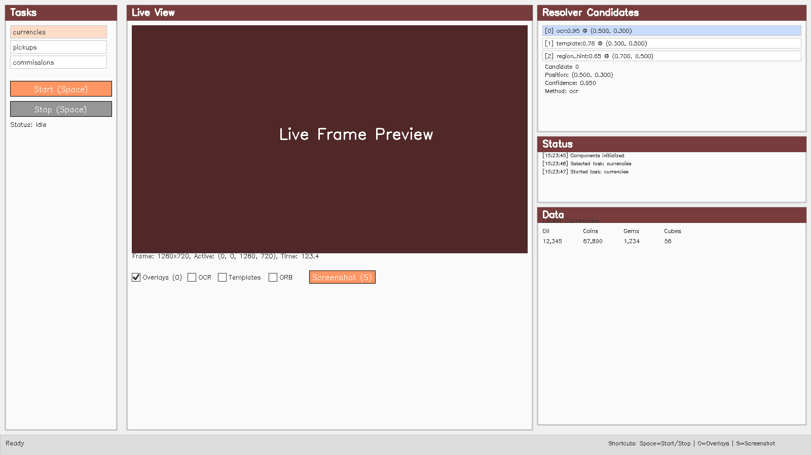

# GUI Enhancements Documentation

## Overview
The Azur Lane Bot GUI has been enhanced with task controls, candidate inspection, and live overlays to aid operation and debugging.


*Complete GUI layout with task sidebar, live view, and candidate inspector*

## Features

### 1. Task Control Sidebar
- **Location**: Left panel of the GUI
- **Features**:
  - Lists all available tasks from the task registry (e.g., currencies, pickups, commissions)
  - Start/Stop buttons for task execution
  - Real-time task status display
  - Click to select a task, then press Start to run it

### 2. Keyboard Shortcuts
| Key | Action | Description |
|-----|--------|-------------|
| **Space** | Start/Stop Task | Toggles the currently selected task |
| **O** | Toggle Overlays | Shows/hides all overlay visualizations |
| **S** | Save Screenshot | Saves the current frame to `~/.azlbot/screenshots/` |

### 3. Candidate Inspector
- **Location**: Right panel (top section)
- **Features**:
  - Lists all resolver candidates with their confidence scores and methods
  - Format: `[index] method:confidence @ (x, y)`
  - Click a candidate to:
    - Highlight it with an orange circle on the live view
    - Show detailed information (position, confidence, method)
    - Zoom/focus on the selected candidate's ROI

### 4. Live Overlays
The GUI now supports multiple overlay types that can be toggled individually:

#### Overlay Types
1. **Regions** (always visible when overlays enabled)
   - Shows the configured UI regions (top_bar, bottom_bar, left_panel, center, right_panel)
   - Blue rectangles with labels

2. **Candidates** (enabled by default)
   - Shows resolver detection candidates
   - Color-coded by confidence:
     - Green: High confidence (≥0.8)
     - Cyan: Medium confidence (≥0.6)
     - Red: Low confidence (<0.6)
     - Orange: Selected candidate (with larger circle)

3. **OCR Boxes** (toggle with checkbox)
   - Shows text detection bounding boxes
   - Displays recognized text above each box
   - Color-coded by OCR confidence

4. **Template Matches** (toggle with checkbox)
   - Shows template matching results
   - Square markers at match locations
   - Labeled with template name and confidence

5. **ORB Keypoints** (toggle with checkbox)
   - Shows ORB feature detection keypoints
   - Small yellow circles at feature locations

### 5. Screenshot Functionality
- **Access**: Press 'S' key or click "Screenshot (S)" button
- **Location**: Screenshots are saved to `~/.azlbot/screenshots/` directory
- **Format**: PNG files with timestamp naming: `screenshot_YYYYMMDD_HHMMSS.png`
- **Content**: Saves the current frame (without overlays)

## Usage Examples

### Starting a Task
1. Select a task from the task list (left sidebar)
2. Click "Start (Space)" or press Space key
3. Task status will show "Running..."
4. Click "Stop (Space)" or press Space again to stop

### Inspecting Candidates
1. Ensure "Overlays (O)" is checked
2. Candidates will appear as colored circles on the live view
3. Click a candidate in the "Resolver Candidates" list
4. Selected candidate will be highlighted in orange
5. Detailed information appears below the list

### Customizing Overlays
1. Check/uncheck "Overlays (O)" to enable/disable all overlays
2. Individual toggles:
   - **OCR**: Show/hide OCR text detection boxes
   - **Templates**: Show/hide template matching results
   - **ORB**: Show/hide ORB feature keypoints
3. Changes take effect immediately on the live view

## Configuration

### config/app.yaml
The UI section now supports additional configuration options:

```yaml
ui:
  show_llm_json: false          # Show/hide LLM JSON response viewer
  zoom_overlay: true            # Enable zoom on selected candidates
  hotkeys:
    start_stop: "Space"         # Key to start/stop tasks
    toggle_overlays: "O"        # Key to toggle overlay display
    save_screenshot: "S"        # Key to save screenshot
  overlays:
    show_regions: true          # Show region boundaries
    show_candidates: true       # Show resolver candidates
    show_ocr_boxes: false       # Show OCR text boxes
    show_template_matches: false # Show template match locations
    show_orb_keypoints: false   # Show ORB feature keypoints
  screenshot_dir: "screenshots" # Directory for saved screenshots
```

## Technical Details

### UI State Management
The `UIState` class now tracks:
- `show_ocr_boxes`: OCR overlay toggle state
- `show_template_matches`: Template overlay toggle state
- `show_orb_keypoints`: ORB overlay toggle state
- `show_regions`: Region overlay toggle state
- `show_candidates`: Candidate overlay toggle state
- `selected_candidate_index`: Currently selected candidate for highlighting

### Overlay Rendering
The `OverlayRenderer` class supports:
- Conditional rendering based on toggle states
- Highlighted rendering for selected candidates
- Multiple overlay types on a single frame
- Color-coded confidence visualization

## Troubleshooting

### Candidates Not Showing
- Ensure "Overlays (O)" checkbox is checked
- Verify a task is running or has run recently
- Check that candidates are being detected by the resolver

### Screenshots Not Saving
- Verify the datastore is initialized
- Check write permissions for `~/.azlbot/screenshots/`
- Ensure the capture device is connected and working

### Keyboard Shortcuts Not Working
- Ensure the main window has focus
- Check for keyboard focus in other widgets (lists, text areas)
- Try clicking on the live view area first

## Performance Considerations

### UI Responsiveness
- The GUI uses a separate thread for task execution
- Frame refresh rate is 2 FPS by default (configurable)
- Overlay rendering is optimized to avoid frame drops

### Memory Usage
- Candidates and OCR results are stored in memory
- Only the latest results are retained
- Screenshots are saved to disk immediately

## Future Enhancements
- Zoom/pan functionality for selected candidates
- Recording/playback of overlay sequences
- Export overlay data for analysis
- Custom overlay color schemes
